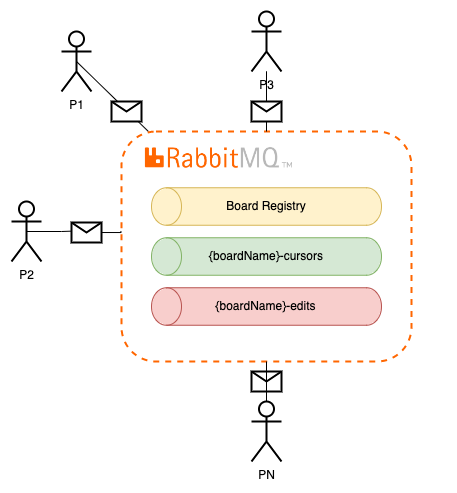
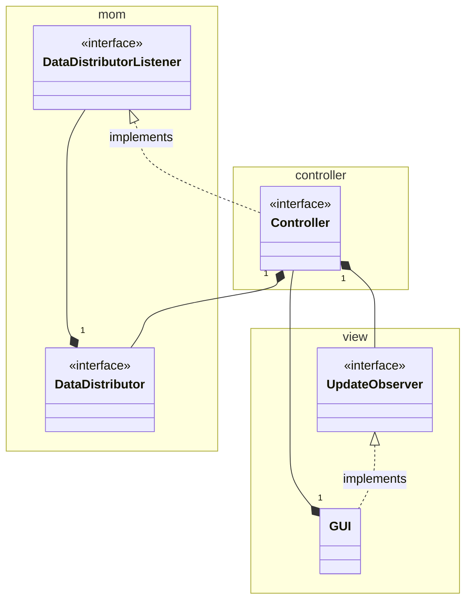
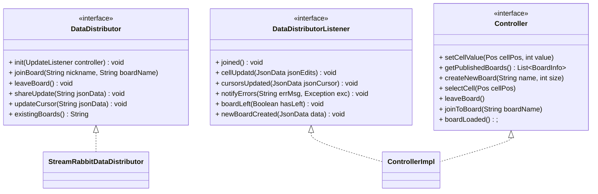
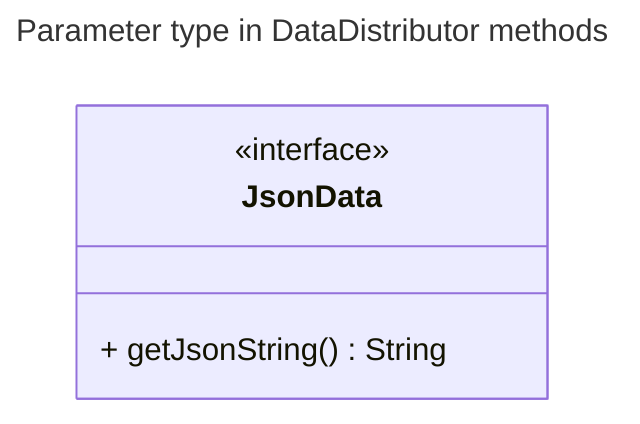
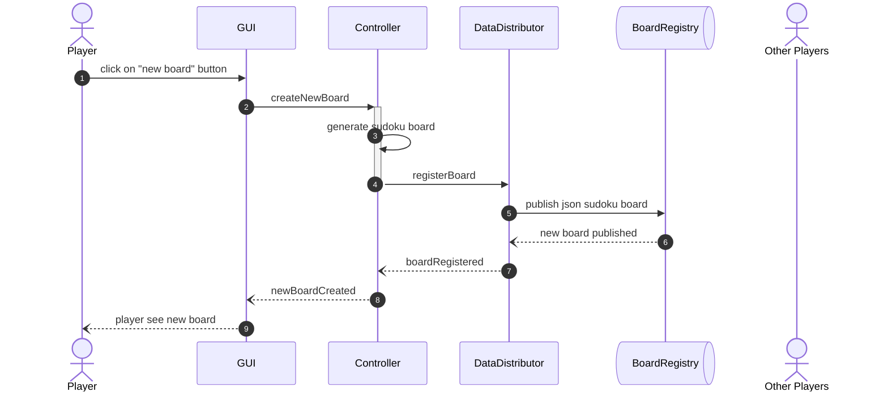
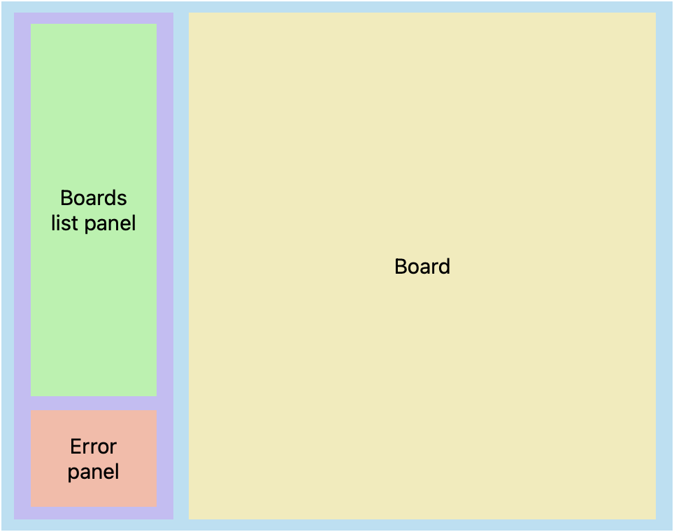

# Cooperative Sudoku - MOM Version

## Architettura

Dalla versione 3.9 di RabbitMQ viene introdotto il paradigma di Stream portando diversi vantaggi per specifiche applicazioni che prevedono:

- **un'architettura fan-out**: dove molti *consumer* leggono lo stesso messaggio immutabile e persistente nello stream;

- **il replay & time-travel**: dove i *consumers* necessitano di leggere più volte lo stesso messaggio o di muoversi fra i messaggi e iniziare la lettura da un punto preciso;

- **un grande throughput**: dove una grande mole di dati deve essere processata in pochi secondi. Nel caso specifico del Sudoku collaborativo si ha una grande quantità di aggiornamenti dei cursoi degli utenti e delle celle nel caso vi siano molti utenti conessi alla stessa board.

L'architettura generale comprende:

- il `boardRegistry` per la pubblicazione delle board di gioco. Per comodità è anch'esso uno stream rabbitMQ; potrebbe essere un server, un database o persino un file condiviso;

- lo stream `{boardName}-edits` in cui vengono pubblicati gli aggiornamenti delle celle;

- lo stream `{boardName}-user-cursors` per gli aggiornamenti dei cursori dei giocatori.

**NOTA**: per ogni board pubblicata vengono generati i due stream `edits` e `user-cursors` per la board `{boardName}`.

In figura l'architettura della sooluzione implementata basata su scambio di messaggi con MOM (Message-oriented middleware).

## UML - Work in progress :construction:

## UML Interfacce dettagliato

# Note-Appunti

## RabbitDataDistributor  
- [X] Tutti i metodi prendono in input una ~~stringa~~ `JsonData` json del Messaggio da inviare —> quindi è chi chiama il metodo che deve preparare i dati e convertirli in json  
- [X] Gli handler dei messaggi ricevuti vengono definiti fuori ( da messaggio json string poi fuori questa classe uni si arrangia a convertire e gestire i dati)  
- [x] Aggiungere metodo alla api così da sapere se esiste una coda o no (aggiungere una nuova coda stream che contiene tutte le board create con lo stato iniziale)  
  
  
1. Chiedi se esiste già la board  
2. Fai join (internamente fa subscribe a stream della board e collegamento consume handler mag ricevuti)  
3. Se non esisteva (al esito del punto 1) allora dichaira/ pubblica nel registro delle Baird lo stato della board e il nome (su board registry)  

Alla fine quindi avrei tre stream:  
  
BoardRegistry 🟫🟫🟫🟫🟫🟫🟫🟫  
{boardName}-user-cursors 🟩🟩🟩🟩🟩🟩🟩🟩  
{boardName}-edits 🟪🟪🟪🟪🟪🟪🟪🟪  
  
Il 🟩 avrebbe una retention dei messaggi bassa = dopo X minuti/secondi e spazio occupato di 1MB cancella i messaggi pubblicati. Alla sottoscrizione è possibile ottenere solo l'ultimo messaggio pubblicato oppure N messaggi (anche tutti).
  
**Dinamica di collegamento base:**  
1. Da 🟫 ottengo le board attive (e il loro schema iniziale)  
2. Mi collego ad una board  
    1. Una esistente tra quelle registrate  
        1. Carico lo schema iniziale della board (presente in 🟫, in locale ho tutte le board iniziali dal momento in cui viene pubblicata una)
        2. Una volta completato il caricamento dello schema di gioco, sottoscrivo a 🟪 e 🟩
    2. Creo una nuova (se non esistente)
        1. Registro/pubblico board in 🟫 
        2. punto 2.1
3. Ogni selezione di cella viene pubblicata su 🟩  
4. Ogni modifica (inserimento o cancellazione di valore) di cella viene pubblicata su 🟪  

* Se voglio **cambiare board** faccio leave board (discrivo dalle code 🟪🟩).

Nel seguente diagramma di sequenza viene presentato tutto lo stack di chiamate fra i doiversi componenti dell'architettura a seguito della richiesta di creazione di un nuovo Sudoku. Buona parte delle interazioni (se non tutte) dell'utente con la GUI innescano richieste nei livelli sottostanti.

Ogni qualvolta che viene pubblicato un aggiornamento di qualsiasi genere (creazione di una board, modifica di una cella, moviemtno del cursore) in tutti i player partecipanti viene innescata la sequenza di chiamate dal numero 6 al 9 (riferimento allo schema sottostante).

### Aspetti implementativi di RabbitMQ
Non memorizzo alcun riferimento perchè in caso di sconnnessione ci si riconnette e si sottoscrive nuovamente allo stream ottenendo tutti i messaggi dall'inizio.

Come possibile ottimizzazione si potrebbe memorizzare l'identificativo dell'ultimo messaggio ricevuto e in fase di riconnessione dichiarare il subscribe ai messaggi a partire da quel ID.

## Interfaccia Grafica

