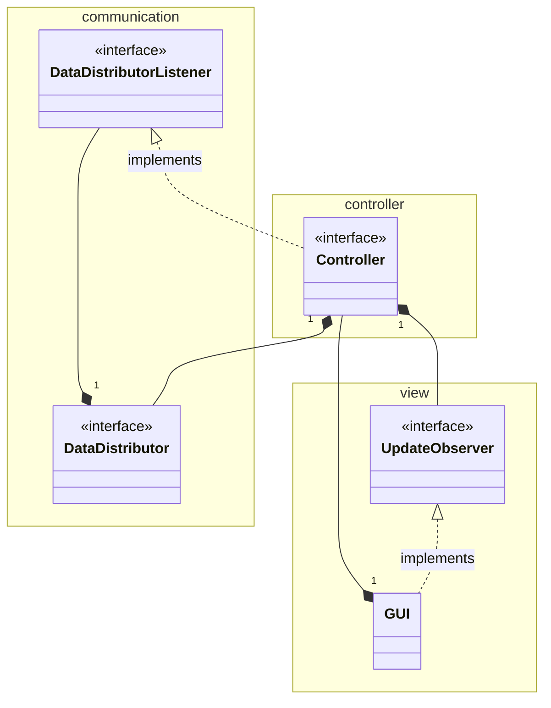
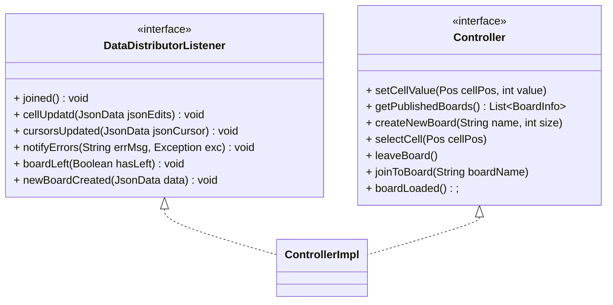
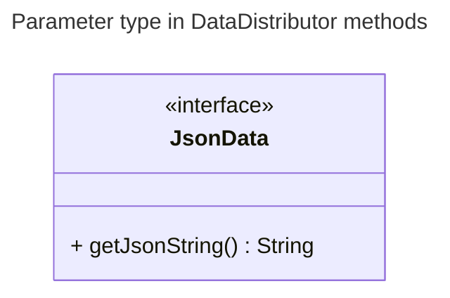
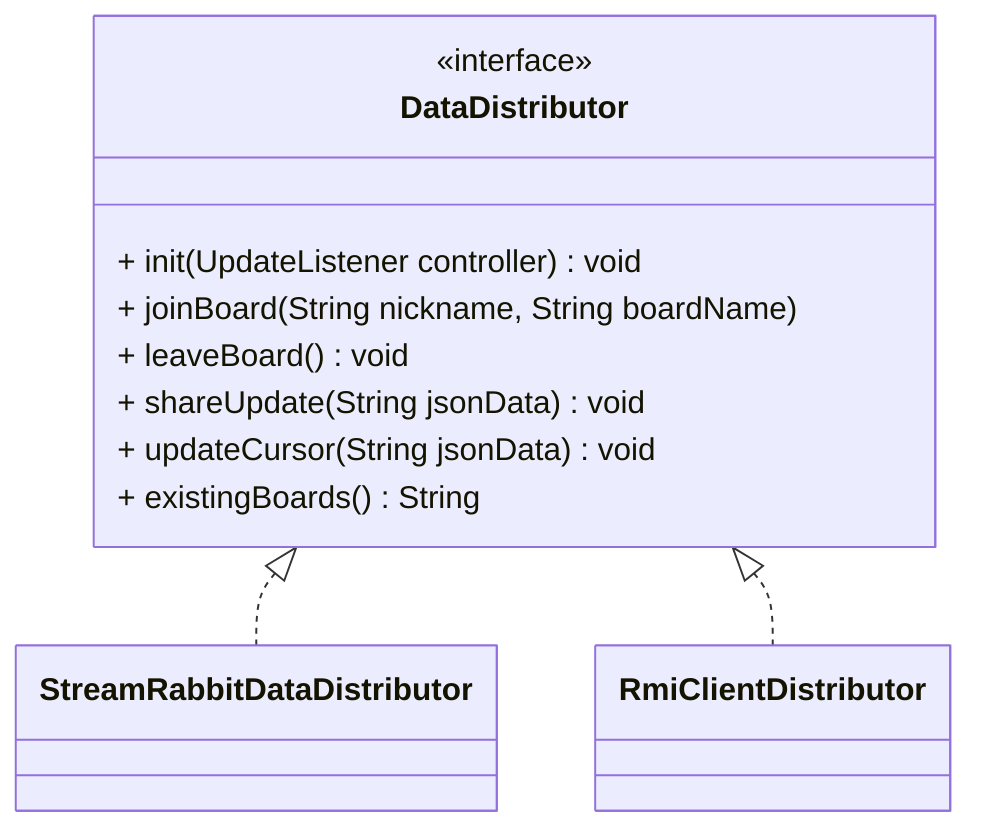
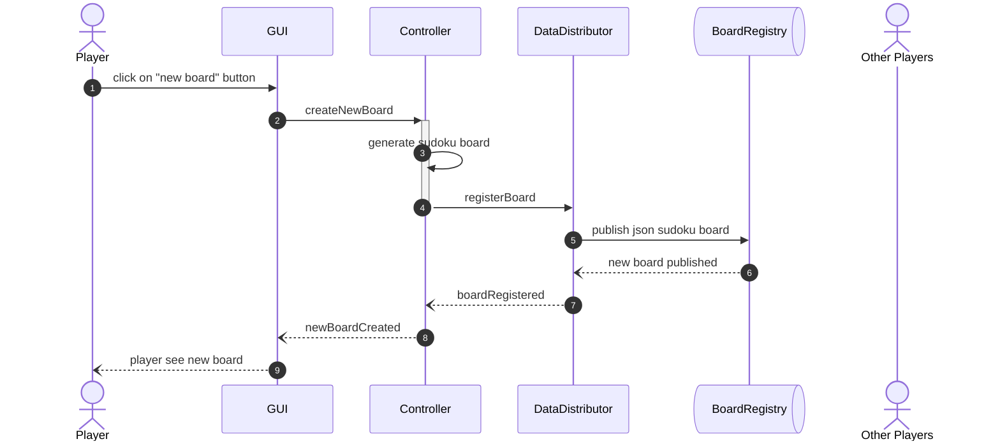
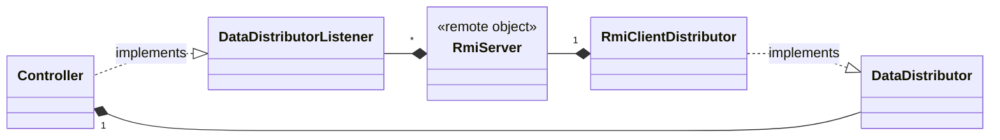
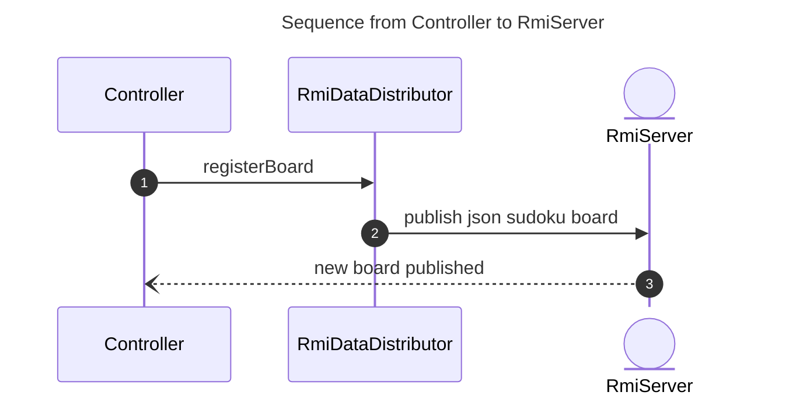
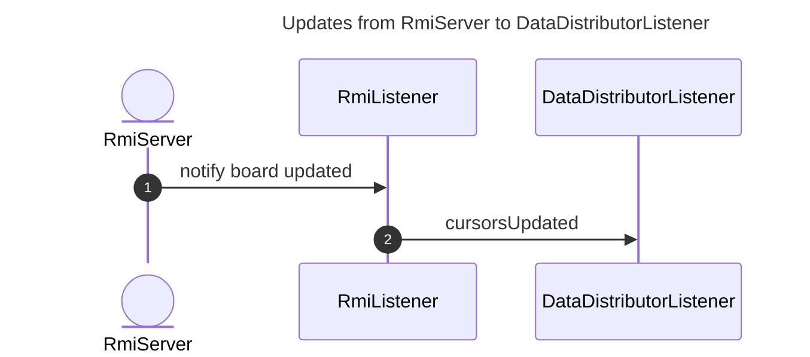

# Cooperative Sudoku

## Architettura
L'architettura generale del Cooperative Sudoku, sia nella versione MOM che quella con RMI, prevede tre componenti principali che non dipendono dalla effettiva tecnologia utilizzata per la distribuzione delle informazioni delle board di gioco e dei giocatori.

Come si può vedere nel seguente UML delle classi i componenti sono:
- il `Controller`, che implementa l' interfaccia `DataDistributorListener` in quanto interessato agli aggiornamenti ricevuti dall'esterno;
- il `DataDistributor`, si occupa della distribuzione e ricezione degli aggiornamenti della board a cui si sta giocando;
- e la `GUI`, che impelementa l'interfaccia `UpdateObserver`.

**UML - Work in progress :construction:**

Nello schema sono stati indicati i package a cui i compnenti e le interfacce appartengono.

### UML Interfacce dettagliato





## Componente di distribuzione

● architettura decentralizzata basata su scambio di messaggi, usando MOM
● secondo modo utilizzando un approccio basato su Distributed Object Computing,
utilizzando Java RMI (in questo caso l'architettura non deve essere necessariamente
decentralizzata).



## Architettura decentralizzata usando MOM
Dalla versione 3.9 di RabbitMQ viene introdotto il paradigma di Stream portando diversi vantaggi per specifiche applicazioni che prevedono:

- **un'architettura fan-out**: dove molti *consumer* leggono lo stesso messaggio immutabile e persistente nello stream;

- **il replay & time-travel**: dove i *consumers* necessitano di leggere più volte lo stesso messaggio o di muoversi fra i messaggi e iniziare la lettura da un punto preciso;

- **un grande throughput**: dove una grande mole di dati deve essere processata in pochi secondi. Nel caso specifico del Sudoku collaborativo si ha una grande quantità di aggiornamenti dei cursoi degli utenti e delle celle nel caso vi siano molti utenti conessi alla stessa board.

L'architettura generale comprende:

- il `boardRegistry` per la pubblicazione delle board di gioco. Per comodità è anch'esso uno stream rabbitMQ; potrebbe essere un server, un database o persino un file condiviso (con opportuni meccanismi di accesso concorrente);

- lo stream `{boardName}-edits` in cui vengono pubblicati gli aggiornamenti delle celle;

- lo stream `{boardName}-user-cursors` per gli aggiornamenti dei cursori dei giocatori.

**NOTA**: per ogni board pubblicata vengono generati i due stream `edits` e `user-cursors` per la board `{boardName}`.

<div align="center"></div>
In figura l'architettura della sooluzione implementata basata su scambio di messaggi con MOM (Message-oriented middleware) utilizzando nello specifico RabbitMQ-stream.

<!-- DA SISTEMARE E INTEGRARE -->
# Note-Appunti

### RabbitDataDistributor  
- [X] Tutti i metodi prendono in input una ~~stringa~~ `JsonData` json del Messaggio da inviare —> quindi è chi chiama il metodo che deve preparare i dati e convertirli in json  
- [X] Gli handler dei messaggi ricevuti vengono definiti fuori ( da messaggio json string poi fuori questa classe uni si arrangia a convertire e gestire i dati)  
- [x] Aggiungere metodo alla api così da sapere se esiste una coda o no (aggiungere una nuova coda stream che contiene tutte le board create con lo stato iniziale)  
  
  
1. Chiedi se esiste già la board  
2. Fai join (internamente fa subscribe a stream della board e collegamento consume handler mag ricevuti)  
3. Se non esisteva (al esito del punto 1) allora dichaira/ pubblica nel registro delle Baird lo stato della board e il nome (su board registry)  

Alla fine quindi avrei tre stream:  
  
BoardRegistry 🟫🟫🟫🟫🟫🟫🟫🟫  
{boardName}-user-cursors 🟩🟩🟩🟩🟩🟩🟩🟩  
{boardName}-edits 🟪🟪🟪🟪🟪🟪🟪🟪  
  
Il 🟩 avrebbe una retention dei messaggi bassa = dopo X minuti/secondi e spazio occupato di 1MB cancella i messaggi pubblicati. Alla sottoscrizione è possibile ottenere solo l'ultimo messaggio pubblicato oppure N messaggi (anche tutti).
  
**Dinamica di collegamento base:**  
1. Da 🟫 ottengo le board attive (e il loro schema iniziale)  
2. Mi collego ad una board  
    1. Una esistente tra quelle registrate  
        1. Carico lo schema iniziale della board (presente in 🟫, in locale ho tutte le board iniziali dal momento in cui viene pubblicata una)
        2. Una volta completato il caricamento dello schema di gioco, sottoscrivo a 🟪 e 🟩
    2. Creo una nuova (se non esistente)
        1. Registro/pubblico board in 🟫 
        2. punto 2.1
3. Ogni selezione di cella viene pubblicata su 🟩  
4. Ogni modifica (inserimento o cancellazione di valore) di cella viene pubblicata su 🟪  

* Se voglio **cambiare board** faccio leave board (discrivo dalle code 🟪🟩).

Nel seguente diagramma di sequenza viene presentato tutto lo stack di chiamate fra i doiversi componenti dell'architettura a seguito della richiesta di creazione di un nuovo Sudoku. Buona parte delle interazioni (se non tutte) dell'utente con la GUI innescano richieste nei livelli sottostanti.

Ogni qualvolta che viene pubblicato un aggiornamento di qualsiasi genere (creazione di una board, modifica di una cella, movimetno del cursore) in tutti i player partecipanti viene innescata la sequenza di chiamate dal numero 6 al 9 (riferimento allo schema sottostante).



### Aspetti implementativi di RabbitMQ
- Non memorizzo alcun riferimento perchè in caso di sconnnessione ci si riconnette e si sottoscrive nuovamente allo stream ottenendo tutti i messaggi dall'inizio.

- Come possibile ottimizzazione si potrebbe memorizzare l'identificativo dell'ultimo messaggio ricevuto e in fase di riconnessione dichiarare il subscribe ai messaggi a partire da quel ID in modo da non dover riottenere tutti i messaggi dal primo.

## DataDistributor - versione RMI



Come da requisiti, seguendo l'approccio Distributed Object Computing, è stato anche sviluppato il server RMI nonchè l'oggetto distribuito fra i diversi client di ciascun giocatore connesso.

Per questa versione quindi come `DataDistributor` viene utilizzato il `RmiClientDistributor`; funge da oggetto client per interagire con il server RMI (`RmiServer`).

Per evitare di esporre indistintamente tutti i metodi del `Controller` all'oggetto remoto `RmiServer` è stato creato un livello di astrazione che permette al server remoto di accedere unicamente ai metodi dei client che riguardano la ricezione degli aggiornamenti della board, dei cursori e delle board create disponibili.

Concretamente il server remoto vede i client connessi come `RmiListener`, di seguito ne viene riportata la definizione:

```java
public interface RmiListener extends Remote {
    public void cellUpdated(CellUpdate edits) throws RemoteException;
    public void cursorsUpdated(UserInfo userInfo) throws RemoteException;
    public void boardRegistered(BoardInfo boardInfo) throws RemoteException;
    public void boardLeft(Boolean hasLeft) throws RemoteException;
    public void joined(BoardInfo boardInfo, int[][] currentState) throws RemoteException;
}
```

In questo caso l'oggetto server viene registrato con nome `RmiServer` e l'oggetto remoto diventa recuperabile ed utilizzabile. 
Il client prima ottiene il registro RMI quindi ottiene l'oggetto del server fornendo il nome registrato e una volta ottenuto può indirizzare le richieste di registrazione ad una board di gioco e anche pubblicare/ricevere tutti gli aggiornamenti per quella board.

`RmiClientDistributor` è l'implementazione specifica del `DataDistributor` che utilizza RMI per la condivisione delle informazioni live tra i giocatori.


---
Internamente l' `RmiServer` memorizza le informazioni dell'utente e delle varie board di gioco all'interno di Map in cui la chiave è il nome della board. 

Per ciascuna board vengono memorizzati tutti gli `RmiListener` interessati agli aggiornamenti di una board, le board create e pubblicate e infine lo stato attuale della board con tutte le sue modifiche.
Le informazioni vengono mantenute in modo thread-safe utilizzando `ConcurrentHashMap`.

```java
  public final String GLOBAL_UPDATES_TOPIC = "GLOBAL";
  private final Map<String, List<RmiListener>> boardObservers;
  private final Map<String, Domain.BoardInfo> boards;
  private final Map<String, int[][]> boardState;
```

Per quanto riguarda le posizioni dei cursori di ciascun partecipante ad una board vengono direttamente propagati agli altri senza essere memorizzati; questa decisione previene la visualizzazione dei cursori di utenti inattivi al momento del *join* ad una board.

Di seguito viene mostrato il codice che implementa questo meccanismo di aggiornamento broadcast quando un utente si muove su una board:

```java
  @Override
    public void updateCursor(Domain.UserInfo userInfo, String boardName) throws RemoteException {
        this.boardObservers.get(boardName).forEach(o -> {
            try {
                o.cursorsUpdated(userInfo);
            } catch (RemoteException e) {
                throw new RuntimeException(e);
            }
        });
    }
```




---




## Interfaccia Grafica

<div align="center"></div>
