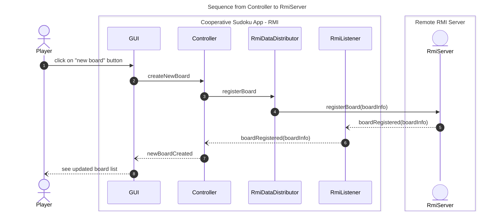

# Cooperative Sudoku <p style="font-size: 12pt;">Corso di PCD - Assignment #3</p>

<div align="center"></div>

Cooperative Sudoku è un progetto che mira a realizzare una versione distribuita e cooperativa del gioco del Sudoku. L'applicazione permette ai giocatori in rete di creare dinamicamente nuove griglie da risolvere o partecipare alla risoluzione di griglie già create in modo del tutto trasparente su quale tecnologia effettiva venga utlizzata per la sincronizzazione degli stati della griglia.

<!-- ## Demo Video
<div align="center">
  <video width="50%" controls autoplay loop>
    <source src="./doc/demo-video.mov" type="video/quicktime">
  </video>
</div> -->

### Problema Affrontato
Il problema principale è la realizzazione di una soluzione distribuita che garantisca consistenza e sincronizzazione dello stato della griglia tra tutti i giocatori. La soluzione deve permettere a giocatori in rete di partecipare dinamicamente, anche in caso di crash.

### Soluzioni Proposte
Da requisiti è richiesto lo sviluppo di due soluzioni basate su:

1. **MOM (Message-Oriented Middleware)** per la comunicazione tra i giocatori;

2. **Distributed Object Computing** utilizzando Java RMI (Remote Method Invocation);

### Requisiti
- Possibilità di partecipare dinamicamente alla risoluzione di una griglia.
- Qualsiasi giocatore può entrare o uscire dinamicamente, anche a causa di crash, disconnessione o chiusura dell'app.
- Consistenza dello stato della griglia e sincronizzazione delle selezioni tra tutti i giocatori.

## Architettura
L'architettura generale del Cooperative Sudoku, sia nella versione MOM che quella con RMI, prevede tre componenti principali che non dipendono dalla effettiva tecnologia utilizzata per la distribuzione delle informazioni delle board di gioco e dei giocatori.

Come si può vedere nel seguente UML delle classi i componenti sono:
- il `Controller`, implementa l'interfaccia `DataDistributorListener` in quanto interessato a tutti gli aggiornamenti che riguardano la board di gioco, i cursori degli utenti e le board disponibili pubblicate;
- il `DataDistributor`, fulcro di questo progetto, si occupa della logica di condivisione, ricezione ed invio fra i diversi giocatori;
- e la `GUI`, che impelementa l'interfaccia `UpdateObserver`.

### Diagramma delle classi

Nello schema sono stati indicati i package a cui i compnenti e le interfacce appartengono.

### UML Interfacce dettagliato


<!-- ``` mermaid
---
title: Parameter type in DataDistributor methods
---
classDiagram
class JsonData {
  <<interface>>
  + getJsonString() String
}
``` -->

## Componente di distribuzione
Le due versioni del Cooperative Sudoku sono caratterizzate dalla specifica implementazione del `DataDistributor`.

- La prima versione prevede un'architettura decentralizzata basata su scambio di messaggi, usando MOM (Message Oriented Middleware). La sua implementazione è `StreamRabbitDataDistributor` ed utilizza gli stream di [RabbitMQ](https://www.rabbitmq.com/docs/streams).

- La seconda versione invece si basa sul Distributed Object Computing utilizzando [Java RMI](https://docs.oracle.com/javase/8/docs/technotes/guides/rmi/index.html) con architettura centralizzata (no replicazione del server). La sua implementazione è `RmiClientDistributor` e l'oggetto server è il `RmiServer`.


## Architettura decentralizzata usando MOM

### Premessa
Dalla versione 3.9 di RabbitMQ viene introdotto il paradigma di Stream portando diversi vantaggi per specifiche applicazioni che prevedono:

- **un'architettura fan-out**: dove molti *consumer* leggono lo stesso messaggio immutabile e persistente nello stream;

- **il replay & time-travel**: dove i *consumers* necessitano di leggere più volte lo stesso messaggio o di muoversi fra i messaggi e iniziare la lettura da un punto preciso;

- **un grande throughput**: dove una grande mole di dati deve essere processata in pochi secondi. Nel caso specifico del Sudoku collaborativo si ha una grande quantità di aggiornamenti dei cursoi degli utenti e delle celle nel caso vi siano molti utenti conessi alla stessa board.

Considerando i vantaggi sopra e la tipologia del progetto si è deciso di utilizzare, anzichè le classiche *queue*, gli stream di RabbitMQ. Questa decisione porta sicuramente una gestione semplificata dei messaggi uno-molti e specialmente per il replay & time-travel.

Sono previsti i seguenti stream RabbitMQ:

- il `boardRegistry` per la pubblicazione delle board di gioco. Per comodità è anch'esso uno stream rabbitMQ; potrebbe essere un server, un database o persino un file condiviso (con opportuni meccanismi di accesso concorrente);

- lo stream `{boardName}-edits` in cui vengono pubblicati gli aggiornamenti delle celle;

- lo stream `{boardName}-user-cursors` per gli aggiornamenti dei cursori dei giocatori.

**NOTA**: per ogni board pubblicata vengono generati i due stream `edits` e `user-cursors` per la board `{boardName}`.

<div align="center"></div>

In figura l'architettura della sooluzione implementata basata su scambio di messaggi con MOM (Message-oriented middleware) utilizzando nello specifico RabbitMQ-stream.

<!-- DA SISTEMARE E INTEGRARE -->

### RabbitDataDistributor
Nella fase di inizializzazione il componente **RabbitDataDistributor** si connette al server RabbitMQ e si registra come listener del *BoardRegistry* per ottenere le informazioni di tutte le board pubblicate in tempo reale.

#### Creazione nuova board
La creazione di una nuova board prevede la generazione dello schema sudoku localmente e poi successivamente viene pubblicato un messaggio contenenete l'oggetto json `Domain.BoardInfo`.

Ogni `BoardInfo` ricevuta pubblicata viene memorizzata nella lista `boardRegistry` del componente.

Di seguito se ne presenta il diagramma di sequenza:

Cosi come l'autore della creazione di una nuova board anche tutti gli altri player sono soggetti alla sequenza di chiamate dal numero 6 al 9 ricevendo così le informazioni della nuova board.

Si noti che finchè la board non viene pubblicata sullo stream `BoardRegistry` nemmeno l'autore della nuova board può vedere la board; questo permette di avere tutti player allienati.

#### Join ad una board
Una volta selezionato il nome della board a cui ci si vuole collegare, viene caricato lo schema iniziale vuoto (punti dal 2 al 5) e concluso il caricamento si sottoscrivono gli stream `edits` e `user-cursors` relativi alla board selezionata (punti dal 7 al 10).


### Presentazione dei metodi interni del componente DataDistributor
<details>
<summary><strong>createChannel - creazione del canale di comunicazione</strong></summary>

```java
private Optional<Channel> createChannel()  {
  ConnectionFactory factory = new ConnectionFactory();
  factory.setHost(this.rabbitHost.orElse("localhost"));
  Optional<Channel> optChannel = Optional.empty();
  try {
      optChannel = factory.newConnection().openChannel();
  } catch (IOException | TimeoutException exc) {
      updateListener.notifyErrors("Init error channel creation fail", exc);
  }
  return optChannel;
}
```
</details>

<details>
<summary><strong>declareQueue - dichiarazione di una coda</strong></summary>

La dichiarazione di una coda richiede la presenza di un *channel*, il nome della coda e la sua configurazione. Nel caso una coda/stream sia già presente questa non viene ricreata e viene restituito esito positivo.

```java
private Optional<DeclareOk> declareQueue(String name, Optional<Channel> channel, QueueConfigs configs) {
  if (channel.isPresent()) {
    try {
      DeclareOk isOk = channel.get().queueDeclare(name,
              configs.durable,
              configs.notExclusive,
              configs.notAutoDelete,
              configs.params);
      return Optional.of(isOk);
    } catch (IOException exc) {
      this.updateListener.notifyErrors("Declaration queue", exc);
    }
  }
  return Optional.empty();
}
```

</details>

<details>
<summary><strong>consumeMessages - dichiarazione dell'hanlder per il consumo di messaggi</strong></summary>

Questo metodo configura il processo di ricezione dei messaggi dallo stream. Richiede il nome della coda `queueName`, il canale `channel`, la funzione di callback per gestire i messaggi ricevuti, e l'offset `consumeOffset` a partire dal quale iniziare a ricevere i messaggi.

In riferimento al diagramma di sequenza del join di una board, nei punti 9 e 10 viene chiamato esattamente questo metodo.

```java
private void consumeMessages(String queueName, Optional<Channel> channel, Consumer<Delivery> consume, String consumeOffset) {
  Optional<String> tag = Optional.empty();
  if (channel.isPresent()) {
    Channel ch = channel.get();
    boolean autoAck = false;
    try {
      ch.basicQos(PREFETCH_COUNT);
      String cTag = ch.basicConsume(queueName,
          autoAck,
          Collections.singletonMap("x-stream-offset", consumeOffset),
          (consTag, msg) -> {
            consume.accept(msg);
            long deliveryTag = msg.getEnvelope().getDeliveryTag();
            ch.basicAck(deliveryTag, true);
          },
          consTag -> {
              System.out.println(consTag + " disconnected from " +  queueName);
          }
      );
      tag = Optional.of(cTag);
    } catch (IOException exc) {
      this.updateListener.notifyErrors("Consuming Message", exc);
    }
  }
  this.consumerTag.put(queueName, tag);
}
```
</details>

<details>
<summary><strong>publishTo - pubblicazione di un messaggio</strong></summary>

Questo metodo privato viene utilizzato per pubblicare un messaggio sul canale di nome `queueName` attraverso il canale `channel` se configurato.
```java
private void publishTo(String jsonMsg, String queueName, Optional<Channel> channel) {
  channel.ifPresent(c -> {
    try {
      c.basicPublish("", queueName, null, jsonMsg.getBytes("UTF-8"));
    } catch (IOException exc) {
      String errMsg = "Error in publishing on queue" + queueName;
      this.updateListener.notifyErrors(errMsg , exc);
    }
  });
}
```
</details>

### Dettagli implementativi di RabbitMQ
Negli stream ciascun messaggio possiede un *riferimento di offset* e all'atto della sottoscrizione dello stream è possibile indicare il riferimento di partenza per ricevere i messaggi. All'atto di sottoscrizione dello stream e possibile indicare uno dei seguenti valori:
- `first`, si sottoscrive dal primo messaggio presente nello stream;
- `last`, si sottoscrive dal messaggio più recente
- `next`, stesso comportamento di non specificare alcun valore
- numero indicante l'offset specifico
- timestamp
- intervallo

Nell'implementazione attuale non viene memorizato alcun riferimento di *offset* specifico ma viene impostato su `first` per lo stream `edits` mentre `last` per lo stream `user-cursors` (di cui non interessa ricevere tutti gli aggiornamenti passati).

Una possibille ottimizzazione futura potrebbe prevedere la memorizzazione dell'offset dell'utlimo messaggio ricevuto in modo da ridurre la mole di messaggi ricevuti in caso di reconnessione. 

## DataDistributor - versione RMI

`RmiClientDistributor` è l'implementazione specifica del `DataDistributor` per la versione RMI del Sudoku cooperativo.


Seguendo l'approccio Distributed Object Computing, è stato sviluppato il server RMI nonchè l'oggetto distribuito fra i diversi client di ciascun giocatore connesso.

Per questa versione quindi è stato implementato il `RmiClientDistributor` che funge da client nell'interazione con il server RMI (`RmiServer`).

Per mantenere l'interfaccia `DataDistributorListener` (e quindi il Controller che la implementa) agnostica dall'effetiva tecnologia utilizzata, è stata creata una nuova interfaccia `RmiListener` che estende `Remote` e funziona da adapter. Questa interfaccia è stata poi implementata dal `RmiListenerImpl`.

Il server remoto si memorizza tutti i client dei giocatori per ciascuna board come `RmiListener`. Di seguito la dichiarazione dell'interfaccia e dei suoi metodi.

```java
public interface RmiListener extends Remote {
    public void cellUpdated(CellUpdate edits) throws RemoteException;
    public void cursorsUpdated(UserInfo userInfo) throws RemoteException;
    public void boardRegistered(BoardInfo boardInfo) throws RemoteException;
    public void boardLeft(Boolean hasLeft) throws RemoteException;
    public void joined(BoardInfo boardInfo, int[][] currentState) throws RemoteException;
}
```
L'oggetto server viene registrato con il nome `RmiServer` e l'oggetto remoto diventa recuperabile ed utilizzabile.
Il client, fornendo il nome, chiede al registro RMI l'oggetto remoto del server e lo usa per propagare e salvare gli aggiornamenti della board e gli aggiornamenti degli utenti.


---
Internamente l' `RmiServer` memorizza le informazioni dell'utente e delle varie board di gioco all'interno di Map in cui la chiave è il nome della board. 

Per ciascuna board vengono memorizzati tutti gli `RmiListener` interessati agli aggiornamenti di una board, le board create e pubblicate e infine lo stato attuale della board con tutte le sue modifiche.
Le informazioni vengono memorizzate dentro una struttura dati thread-safe utilizzando l'implementazione `ConcurrentHashMap`.

```java
  public final String GLOBAL_UPDATES_TOPIC = "GLOBAL";
  private final Map<String, List<RmiListener>> boardObservers;
  private final Map<String, Domain.BoardInfo> boards;
  private final Map<String, int[][]> boardState;
```

Per quanto riguarda le posizioni dei cursori di ciascun partecipante ad una board vengono direttamente propagati agli altri senza essere memorizzati; questa decisione previene la visualizzazione dei cursori di utenti inattivi al momento del *join* ad una board.

sDi seguito se ne mostra il codice:

```java
  @Override
    public void updateCursor(Domain.UserInfo userInfo, String boardName) throws RemoteException {
        this.boardObservers.get(boardName).forEach(o -> {
            try {
                o.cursorsUpdated(userInfo);
            } catch (RemoteException e) {
                throw new RuntimeException(e);
            }
        });
    }
```



---

## Interfaccia Grafica
<div align="center"> </div>